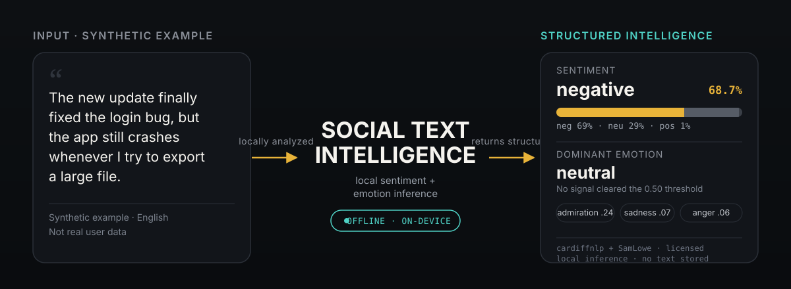
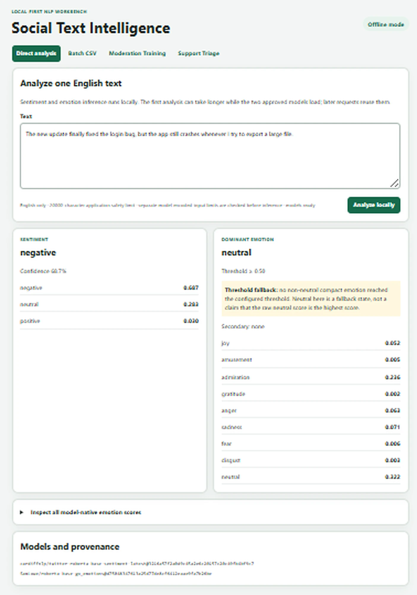
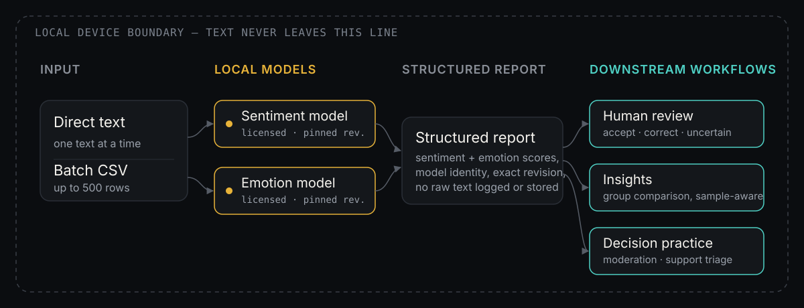

# Social Text Intelligence

A local-first NLP workbench that turns social text — feedback, comments,
support messages, and similar text — into structured, licensed sentiment and
emotion evidence, then carries that evidence through human review,
moderation-decision practice, and support triage. Every model runs on your
own machine; text is not sent to an inference API.

> **Current lifecycle phase: Public Portfolio Delivery.** Feature milestones
> 1–10 are complete, Feature Freeze is PASS, Product Hardening is complete,
> Full Regression and Manual Acceptance is PASS, and the Release Candidate
> Gate is PASS. The repository owner's Version / Delivery Decision approved
> public portfolio delivery of `0.10.0`, and this repository is public. No
> version tag or GitHub Release has been created. Live status:
> [Project Status](PROJECT_STATUS.md).

<p align="center">
  
</p>

## See it work

A real Direct Analysis result from this repository's own local web interface
(`sti-web`, offline mode) — not a mockup or a staged design comp.

<p align="center">
  
</p>

Sentiment scores, the full compact emotion breakdown, threshold semantics,
and exact pinned model identities all render directly from the normalized
report — nothing here is hand-written for the screenshot. Nothing about the
submitted text is logged or persisted.

### Reproduce it yourself

Same report, same pinned models, from the CLI — a shorter path to
independently reproduce the same result:

```text
$ sti analyze "The new update finally fixed the login bug, but the app \
  still crashes whenever I try to export a large file."

Sentiment: negative           (confidence 0.687)
Dominant emotion: neutral     (confidence 0.322)
Emotion threshold: 0.500 (inclusive)   Secondary emotions: none

Compact emotion scores:
  joy=0.052   amusement=0.005   admiration=0.236   gratitude=0.002
  anger=0.063 sadness=0.071     fear=0.006         disgust=0.003
  neutral=0.322

Models:
  cardiffnlp/twitter-roberta-base-sentiment-latest@3216a57f2a0d9c45a2e6c20…
  SamLowe/roberta-base-go_emotions@d75048347613a25d77de8cf6412eaae9fa7b26…
```

## Core capabilities

- **Analyze one text locally** — sentiment and fine-grained emotion from two
  openly licensed models, returned as one structured report with confidence,
  model identity, and revision. [CLI/web](#quick-start)
- **Process a batch while preserving per-item evidence** — upload a CSV,
  preview and validate it, analyze every row, then filter and export results;
  one row's failure never aborts the batch. [Detail](#batch-csv-workflow)
- **Review predictions without losing the AI record** — accept, correct, or
  flag each sentiment/emotion prediction as uncertain, with human and AI
  labels kept separately auditable and compared by *agreement*, not
  "accuracy". [Detail](#human-in-the-loop-review)
- **Compare groups with sample-size discipline** — explore sentiment/emotion
  by source, topic, or community using only user-supplied metadata, with
  small-sample warnings and no cultural generalization.
  [Detail](#insights-and-community-context)
- **Practice structured decisions** — a moderation-training workflow and a
  support-triage workbench built on the same evidence base, where any AI
  suggestion is explicitly labeled as a non-authoritative fixture, never a
  live model. [Detail](#moderation-training) · [Detail](#support-triage)

## How it works

<p align="center">
  
</p>

Direct text or a batch CSV row becomes one normalized input record. Two
pinned, licensed Hugging Face models — a sentiment classifier and a
multi-label emotion classifier — run locally against the full text; if either
model's tokenizer cannot consume the complete input within its audited
512-token budget, the request is rejected outright rather than silently
truncated. A successful run produces one structured `AnalysisReport` that
downstream workflows (Review, Insights, Moderation Training, Support Triage)
read but never mutate — every human judgment is stored as a separate,
attributable record next to the immutable AI prediction.

## Engineering evidence

- **Layered architecture.** `contracts -> providers -> services -> interface`,
  with typed contracts that keep raw provider output, normalized application
  output, and human-reviewed output separate. See
  [Architecture](docs/ARCHITECTURE.md).
- **Complete-input inference contract.** Real tokenizer preflight against each
  model's audited token budget; over-budget text gets an explicit error, never
  a silently truncated result — enforced identically in the CLI, Direct
  analysis, and every Batch row.
- **Local-first privacy engineering.** The Flask server binds to `127.0.0.1`
  only, validates Host/Origin/Referer before any state change, and returns a
  self-only Content Security Policy with no-store caching on every response —
  no telemetry, no CDN, no CORS. See [Privacy](docs/PRIVACY.md).
- **Atomic workspace mutation.** Review, Insight, Moderation, and Triage state
  all share one atomic read-modify-write primitive so concurrent actions
  compose on the latest accepted state instead of racing to overwrite it.
- **Gate-based hardening lifecycle.** Ten Product Hardening batches
  (A1–A10), each with its own targeted regression, formal review, and CI run,
  closed every approved finding ahead of a Full Regression, Manual
  Acceptance, and Release Candidate Gate — every gate tied to a tested commit
  SHA in [Project Status](PROJECT_STATUS.md).
- **Transparent model governance.** Model source, exact revision, license,
  and mapping are documented per model; with no model extras installed, a
  Direct analysis submission fails with a clear in-page message instead of a
  crash or traceback. See [Model Governance](docs/MODEL_GOVERNANCE.md).

## Quick start

Python 3.11 or newer is required.

```text
git clone <repository-url>
cd social-text-intelligence
python -m venv .venv
```

Activate the virtual environment using the command appropriate for your
shell, then install the package:

```text
python -m pip install --upgrade pip
python -m pip install -e .
sti about
sti contracts
```

Install the optional local sentiment runtime when you want real inference:

```text
python -m pip install -e ".[sentiment]"
sti sentiment "I am pleased with this synthetic example."
```

Install both model extras for a combined single-text report:

```text
python -m pip install -e ".[sentiment,emotion]"
sti analyze "Thank you so much for the thoughtful help!"
```

The first command invocation downloads the approved model revision from its
original Hugging Face repository into the ignored `model_cache/` directory.
Inference then runs on the local machine; input text is not sent to an
inference API. Use `--offline` after both models are cached to forbid network
retrieval. Both model commands reject an input that the pinned
tokenizer/model cannot consume in full — they never silently truncate or
present partial-text inference as a whole-text result.

Run the local interface after installing the web and model extras:

```text
python -m pip install -e ".[web,sentiment,emotion]"
sti-web
```

Open `http://127.0.0.1:5000`. Use `sti-web --offline` after both pinned model
revisions are cached. On Windows, after the environment and both models are
installed, double-click `start_social_text_intelligence.bat` in the project
folder to start the same offline, loopback-only server and open the browser
automatically.

Run the dependency-free test suite:

```text
python -m unittest discover -s tests -v
python -m compileall -q src tests
```

For the complete contributor workflow, see [Development](docs/DEVELOPMENT.md).

## Capability details

<details>
<summary>Expand for a milestone-by-milestone technical description of every workflow (sentiment, emotion, batch, review, insights, moderation training, support triage, core contracts)</summary>

### Local sentiment analysis

Milestone 3 adds a single-text English workflow through the existing
normalized contracts and provider boundary. Each result includes negative,
neutral, and positive scores, the selected label, confidence, model identity,
and immutable revision. Output is an estimate that still requires contextual
human judgment.

The selected model, alternatives, license evidence, mapping, supply-chain
controls, and limitations are documented in the
[Milestone 3 Model Audit](docs/MODEL_AUDIT.md).

### Fine-grained emotion analysis

Milestone 4 adds an immutable English GoEmotions provider and connects it to
the sentiment provider through the existing `AnalysisService`. The combined
report preserves all 28 native emotion probabilities, compact scores, an
inclusive threshold, dominant emotion, ordered secondary emotions, model
identities, and revisions.

Compact neutral means no mapped non-neutral emotion reached the threshold. It
is not a psychological conclusion. Scores are independent multi-label
probabilities and do not sum to one. See the
[Milestone 4 Emotion Model Audit](docs/EMOTION_MODEL_AUDIT.md) for the full
candidate review, mapping, threshold rules, licenses, and limitations.

### Local analysis interface

Milestone 5 presents the combined analysis through a small, accessible Flask
interface. It shows all sentiment scores, compact and optional native emotion
scores, threshold semantics, immutable model identities, operating mode, and
prominent limitations. Both providers load only on first analysis and are
reused for later requests in the same process. User text is neither logged
nor stored by the application.

### Batch CSV workflow

Milestone 6 adds a separate Batch CSV mode:

1. upload a UTF-8 CSV for preview and validation;
2. select the text column if `text` is absent;
3. explicitly start local analysis;
4. inspect distinct sentiment, dominant-emotion, and multi-label activation
   aggregates;
5. filter row outcomes and explicitly export normalized CSV results.

The default limits are 2 MiB, 500 rows, and a 20,000-character application
safety ceiling per text. Separately, each pinned model enforces its audited
512-token encoded-input budget after real tokenizer encoding, including
special tokens. If either required model cannot consume a row in full, that
row receives an explicit `model_input_too_long` error; no partial inference
is run, other valid rows continue, and exports leave model scores and
provenance blank for the failed row. Required and supported metadata fields
are documented in [Contracts](docs/CONTRACTS.md). Duplicate supplied IDs,
invalid metadata, empty text, unsupported languages, and provider failures
remain row-level outcomes and do not abort the batch. Uploaded content is
held only in bounded, expiring process memory; there is no database,
automatic save, or upload history. Native emotion scores are an optional
export. Use `sti-web --help` to configure the file-byte, row-count, and
per-text limits for a local session.

### Human-in-the-loop review

Milestone 7 adds a focused queue for successfully analyzed batch rows.
Sentiment and emotion are judged independently as `accept`, `correct`, or
`uncertain`. Human labels and notes remain separate from immutable AI
predictions and pinned model provenance. A row becomes reviewed only after
both dimensions have a judgment; partially reviewed and uncertain dimensions
do not enter formal agreement denominators.

The review page supports previous, save-and-next, next-unreviewed,
per-record Accept Both, and All/Unreviewed/Reviewed/Corrected/Uncertain
filters. Its summary reports progress, sentiment confusion, exact
emotion-set agreement, label additions/removals, and a descriptive
confidence-band comparison only after five definitive reviews. It uses the
term agreement rather than accuracy and makes no confidence-calibration
claim.

Reviewed CSV export preserves every original AI field, errors,
provider/model revisions, separate human fields, timestamps, and
true/false/blank agreement semantics. Native emotion scores are optional.
Reviews remain in bounded, expiring process memory until the user exports
them; there is no review database, background save, import, training, or
reviewer account system.

### Insights and community context

Milestone 8 adds a local descriptive insight layer over the existing frozen
batch results and separate review state. Group Explorer and Distribution
Comparison use only trusted user-supplied `source_type`, `source_label`,
`topic`, `community`, `language`, or valid timestamp-month metadata. The
application does not infer groups from text, names, slang, locations, or
model output.

AI prediction, definitive human-reviewed, and AI-human agreement
perspectives remain separate. Every metric displays raw counts, its eligible
denominator, review coverage where relevant, and a per-group sample warning.
Fewer than five eligible records suppress comparative percentage emphasis;
five through nine show a prominent small-sample warning. No view produces
rankings, composite scores, causal claims, cultural generalizations, or
psychological conclusions.

Phrase and Context Notes are written manually by the user and remain
separate from AI and human labels. Representative Cases are selected by
explicit rules such as low confidence, definitive disagreement, correction,
uncertainty, or note presence, and always state why each case appears.
Insight CSV export is an explicit action. Its audit row records UTC export
time, metric definition, sample thresholds, complete input/analysis/review
counts, selection, filters, model provenance, and emotion-threshold
semantics. Group summaries distinguish successful and failed rows; failures
are grouped only from independently valid supported metadata and otherwise
remain explicitly unassigned. Notes include a UTC creation time, while
supporting records and model-native scores are optional. All insight state
remains in the same bounded, expiring process-memory workspace and is
cleared with the batch.

Clearing a batch requires explicit confirmation and explains that its linked
review and insight state will also be removed. Filter submissions return to
the Results section without changing their semantics.

### Moderation training

Milestone 9 adds a separate three-area workflow for preparing cases,
recording structured training decisions, and reviewing feedback. The
repository includes a versioned synthetic moderation policy, 20 synthetic
cases, frozen built-in references, and an explicitly labeled fixture-based
mock recommendation. The mock is not a live moderation model, expert
opinion, or accuracy ground truth.

Structural contract errors reject a decision: required fields, escalation
and unclear reasons, category exclusivity, complete reasoning, and reviewer
note must be valid. Policy-guidance departures remain non-blocking. They are
displayed and retained with the first and final decisions, comparison, and
export without rewriting the user's judgment. Workspace-authored references
are labeled `self_authored` and are never presented as independent review.

Prepared workspace cases snapshot only successful batch records after an
explicit action. Training sessions freeze their policy and reference
versions, preserve immutable first decisions plus explicit final revisions,
and keep cancelled or restarted attempts separate. Summaries show
field-level raw counts, eligible denominators, exclusions, and sample
warnings rather than a composite score or certification claim.

The configurable defaults are 100 prepared cases, 50 cases per session, and
20 retained session attempts. All state is bounded, expiring process memory.
Limits block new creation without silently deleting older cases or
summaries. CSV export is explicit and auditable; user-derived source text,
model signals, context notes, and trusted metadata are excluded by default
and require separate opt-in. See [Moderation Training](docs/MODERATION_TRAINING.md)
for the full contract.

### Support Triage

Milestone 10 adds a separate local Support Triage workbench with three
areas: Source & Routing Guide, Triage Workspace, and Summary & Export. It
uses a versioned project-authored synthetic guide and 22 synthetic tickets.
Users may also explicitly snapshot successfully parsed batch records,
including records whose sentiment or emotion inference failed. Source
provenance remains visible, and no triage decision writes back into batch,
review, insight, or moderation state.

Human decisions keep primary and secondary intents, issue category, urgency,
recommended queue, escalation, recommended next actions, reasons, and notes
separate. Incomplete but legal drafts are explicit. Finalization is atomic,
freezes guide provenance, and preserves the immutable first decision; later
changes are explicit revisions. Structural errors block invalid state, while
synthetic-guide warnings remain non-blocking and auditable.

Independent mode hides any deterministic fixture mock before first
finalize. The assisted simulation may show a mock first but never prefills
the human form. Human–mock agreement and override counts are descriptive,
not accuracy, quality, causality, or operator performance.

Triage state is bounded, expiring process memory: 200 tickets per
workspace, eight concurrent workspaces, and 30-minute sliding inactivity
expiry by default. Limits block creation rather than evicting existing
work. CSV export is explicit, formula-safe, and `no-store`. See
[Support Triage](docs/SUPPORT_TRIAGE.md) for the complete contract and
limitations.

Milestone 10 is the last completed feature milestone for the current
version. Deferred next-version candidates remain outside the `0.10.0`
feature boundary. Detailed live execution state is maintained only in
[Project Status](PROJECT_STATUS.md).

### Core contracts

Milestone 2 introduces a model-library-independent core:

- `NormalizedTextInput` for platform-neutral text and safe metadata;
- compact sentiment and emotion taxonomies;
- normalized and model-native scores kept separately;
- traceable provider/model/revision metadata;
- `SentimentProvider` and `EmotionProvider` protocols;
- deterministic mock providers for fast tests;
- `AnalysisService` for provider-neutral orchestration.

The mock providers remain available for fast tests. They do not inspect
meaning and must never be presented as real predictions. See
[Core Contracts](docs/CONTRACTS.md) for the contract boundaries.

</details>

## Limitations

- **Local, single-user, English-only.** No hosted demo, accounts, or
  persistence; French/multilingual support is an explicitly deferred
  candidate, not a current claim.
- **Estimate, not diagnosis.** Sentiment and emotion output are model
  estimates; they do not reveal a person's true feelings, intent, or
  psychological state, and are not a substitute for human judgment.
- **Moderation and triage "mock" suggestions are fixtures**, not live
  classifiers, accuracy ground truth, or expert opinion — the interface
  labels them as such everywhere they appear.
- **Public portfolio delivery, not a formal release.** The repository owner
  approved public portfolio delivery of `0.10.0` and the repository is
  public, but no version tag or GitHub Release has been created; see
  [Project Status](PROJECT_STATUS.md) for the live gate state.

## Privacy and data

Do not commit real messages, platform exports, personal notes, databases,
credentials, model weights, or generated analysis results. The committed
`data/README.md` is documentation only; all other contents of `data/` are
ignored by default. Public examples must be synthetic and free of personal
information.

See [Privacy](docs/PRIVACY.md) and [Security](SECURITY.md) before working
with real text.

## Licensing

Project source code is licensed under the [MIT License](LICENSE). That
license does not apply to third-party model weights, datasets, or
dependencies. Those assets require separate review and attribution as
described in [Model Governance](docs/MODEL_GOVERNANCE.md) and
[Third-Party Notices](THIRD_PARTY_NOTICES.md).

## Learn more

The stable product and engineering direction is defined in the
[Project Charter](PROJECT_CHARTER.md). Mutable planning and current
execution state are maintained separately:

- [Product Roadmap](ROADMAP.md)
- [Project Status](PROJECT_STATUS.md)
- [Architecture](docs/ARCHITECTURE.md)
- [Feature Complete Manual Audit](docs/FEATURE_COMPLETE_MANUAL_AUDIT.md)
- [Manual Acceptance Gate Standard](docs/MANUAL_ACCEPTANCE_GATE.md)
- [Living Manual QA](manual-qa/manual_review_questionnaire.html)
